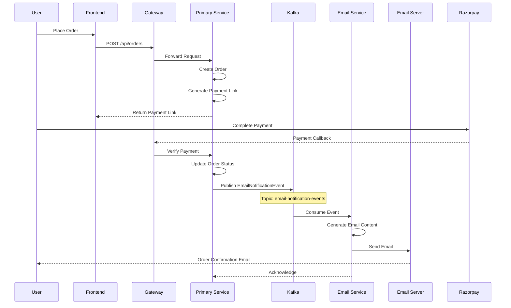
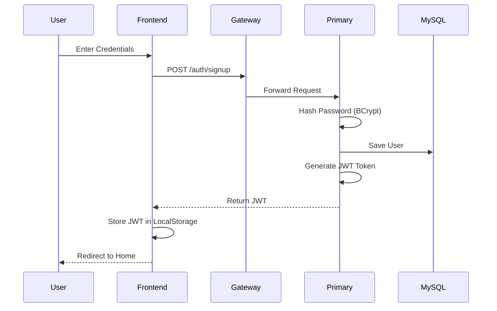
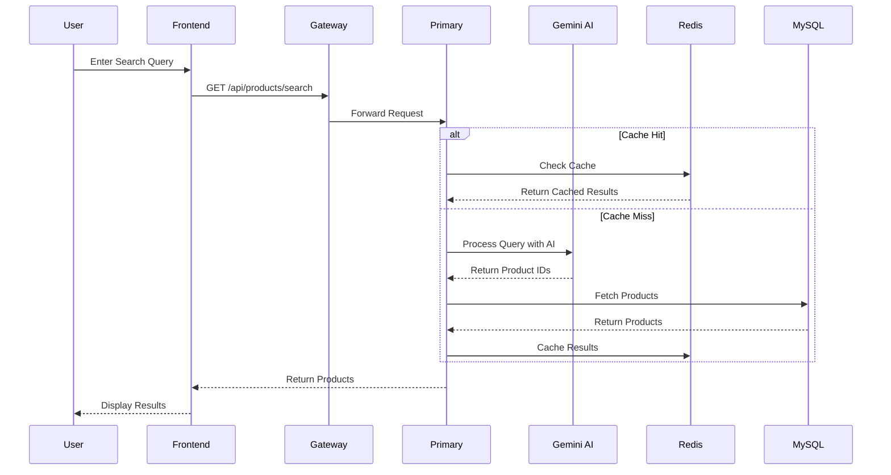
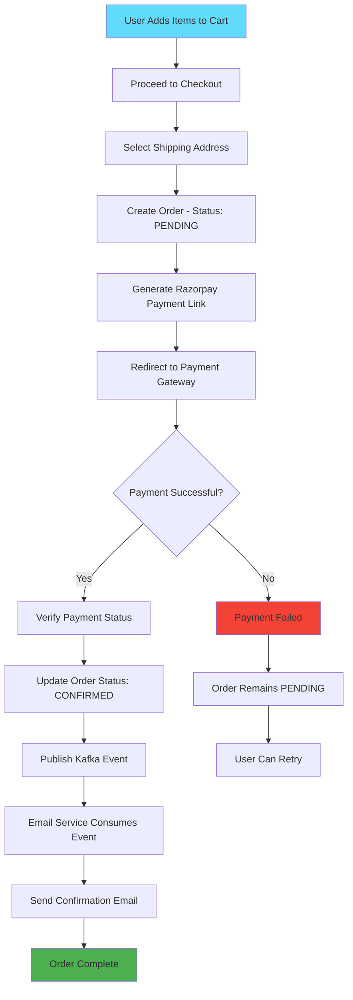
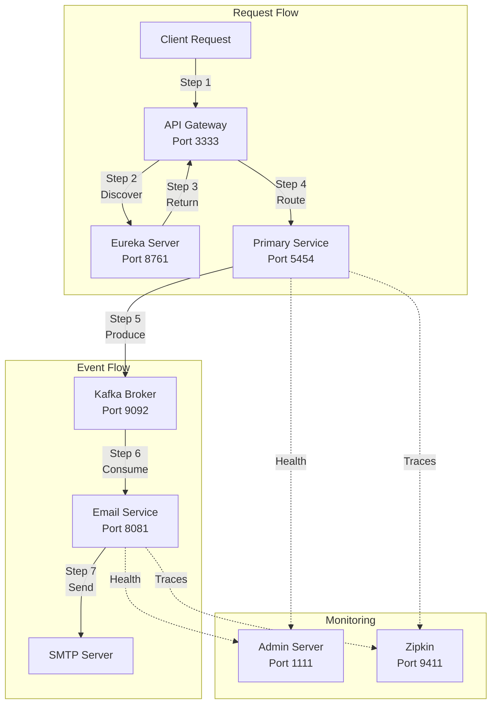

<div align="center">

# 🛍️ IntelliShopy - AI-Powered E-Commerce Platform

[](https://intellishopy.vercel.app)
[](https://spring.io/projects/spring-boot)
[](https://reactjs.org/)
[](https://microservices.io/)

**A modern, scalable e-commerce platform with AI-powered search, event-driven architecture, and microservices design**

</div>

---

## 📋 Table of Contents

- [Overview](#-overview)
- [Features](#-features)
- [Architecture](#-architecture)
- [Tech Stack](#-tech-stack)
- [Application Screenshots](#-application-screenshots)
- [System Workflow](#-system-workflow)
- [Microservices Details](#-microservices-details)
- [Getting Started](#-getting-started)
- [Configuration](#-configuration)
- [API Documentation](#-api-documentation)
- [Testing](#-testing)
- [Security](#-security)
- [Performance Optimization](#-performance-optimization)
- [Docker Support](#-docker-support)
- [Monitoring--observability](#-monitoring--observability)
- [Roadmap](#-roadmap)
- [Contributing](#-contributing)
- [License](#-license)
- [Author](#-author)
- [Acknowledgments](#-acknowledgments)

---

## 🌟 Overview

IntelliShopy is a production-ready, full-stack e-commerce platform built with modern technologies and best practices. It features a microservices architecture, AI-powered product search, secure payment integration, and asynchronous event processing for scalability and reliability.

### Key Highlights

✅ **AI-Powered Search** - Intelligent product discovery using Google Gemini API  
✅ **Microservices Architecture** - Scalable, maintainable, and independently deployable services  
✅ **Event-Driven Design** - Kafka-based asynchronous communication for reliability  
✅ **Secure Authentication** - JWT-based stateless authentication  
✅ **Payment Integration** - Razorpay payment gateway integration  
✅ **High Performance** - Redis caching for improved API latency  
✅ **Service Discovery** - Eureka server for dynamic service registration  
✅ **API Gateway** - Centralized routing and load balancing  
✅ **Monitoring** - Spring Boot Admin & Actuator for health monitoring  
✅ **Distributed Tracing** - Zipkin integration for request tracing  

---

## ✨ Features

### User Features
- 🔐 **User Authentication & Authorization** - Secure JWT-based login/signup
- 🔍 **AI-Powered Product Search** - Smart search using natural language
- 🛒 **Shopping Cart Management** - Add, update, remove items with real-time calculations
- 💳 **Secure Payment Processing** - Razorpay integration with payment confirmation
- 📦 **Order Management** - Track orders from placement to delivery
- ⭐ **Product Reviews & Ratings** - Post-delivery review system
- 📧 **Email Notifications** - Automated order confirmation emails

### Admin Features
- 📊 **Product Management** - CRUD operations for products and categories
- 🏷️ **Category Management** - Three-level category hierarchy
- 📈 **Order Tracking** - Monitor and update order status
- 👥 **User Management** - View and manage customer accounts

### Technical Features
- 🚀 **Redis Caching** - Product and category caching for reduced DB load
- 📨 **Event-Driven Architecture** - Kafka for asynchronous messaging
- 🔄 **Service Discovery** - Eureka for automatic service registration
- 🌐 **API Gateway** - Centralized routing with Spring Cloud Gateway
- 📊 **Monitoring & Observability** - Spring Boot Admin and Zipkin
- 🐳 **Docker Support** - Containerized deployment
- 🔒 **Layered Architecture** - Clean separation of concerns

---

## 🏗️ Architecture

### Microservices Architecture Diagram

```mermaid
graph TB
    subgraph "Client Layer"
        Client[React Frontend<br/>Port: 3000]
    end

    subgraph "Gateway Layer"
        Gateway[API Gateway<br/>Port: 3333]
    end

    subgraph "Service Registry"
        Eureka[Eureka Server<br/>Service Registry<br/>Port: 8761]
    end

    subgraph "Core Services"
        Primary[Primary Service<br/>E-Commerce Backend<br/>Port: 5454]
        Email[Email Service<br/>Notification Handler<br/>Port: 8081]
    end

    subgraph "Infrastructure"
        MySQL[(MySQL Database)]
        Redis[(Redis Cache<br/>Port: 6379)]
        Kafka[Kafka Broker<br/>Port: 9092]
    end

    subgraph "Monitoring"
        Admin[Admin Server<br/>Spring Boot Admin<br/>Port: 1111]
        Zipkin[Zipkin<br/>Distributed Tracing<br/>Port: 9411]
    end

    Client -->|HTTP Requests| Gateway
    Gateway -->|Route Requests| Primary
    Gateway -.->|Service Discovery| Eureka
    
    Primary -.->|Register| Eureka
    Email -.->|Register| Eureka
    
    Primary -->|Read/Write| MySQL
    Primary -->|Cache| Redis
    Primary -->|Produce Events| Kafka
    
    Kafka -->|Consume Events| Email
    Email -->|Send Emails| Client
    
    Primary -.->|Health Metrics| Admin
    Email -.->|Health Metrics| Admin
    Gateway -.->|Health Metrics| Admin
    
    Primary -.->|Trace Data| Zipkin
    Email -.->|Trace Data| Zipkin

    style Client fill:#61DAFB
    style Gateway fill:#68BC71
    style Eureka fill:#FFD700
    style Primary fill:#6DB33F
    style Email fill:#6DB33F
    style Kafka fill:#231F20
    style MySQL fill:#4479A1
    style Redis fill:#DC382D
    style Admin fill:#6DB33F
    style Zipkin fill:#FF6B6B
```



### Event-Driven Workflow



---

## 🛠️ Tech Stack

### Frontend
| Technology | Purpose |
|------------|---------|
| **React 19.x** | UI Framework |
| **Redux** | State Management |
| **React Router** | Client-side Routing |
| **Material-UI** | Component Library |
| **Tailwind CSS** | Styling |
| **Axios** | HTTP Client |
| **Lucide Icons** | Icon Library |

### Backend - Primary Service
| Technology | Purpose |
|------------|---------|
| **Spring Boot 3.x** | Application Framework |
| **Spring Security** | Authentication & Authorization |
| **Spring Data JPA** | ORM & Database Access |
| **MySQL** | Relational Database |
| **Redis** | Caching Layer |
| **Kafka** | Message Broker |
| **JWT** | Token-based Authentication |
| **Razorpay SDK** | Payment Integration |
| **Gemini API** | AI Search |

### Backend - Email Service
| Technology | Purpose |
|------------|---------|
| **Spring Boot** | Microservice Framework |
| **Kafka Consumer** | Event Processing |
| **JavaMailSender** | Email Delivery |
| **Thymeleaf** | Email Templates |

### Infrastructure & DevOps
| Technology | Purpose |
|------------|---------|
| **Docker** | Containerization |
| **Spring Cloud Gateway** | API Gateway |
| **Eureka Server** | Service Registry |
| **Spring Boot Admin** | Monitoring Dashboard |
| **Zipkin** | Distributed Tracing |
| **Maven** | Build Tool |
| **Vercel** | Frontend Deployment |

---

## 📸 Application Screenshots

### Home Page
*Browse our curated collection of products with an intuitive interface*


---

### AI-Powered Search
*Experience intelligent product discovery with natural language search*


**Search Results**  
*Get relevant products instantly with AI-powered recommendations*


---

### User Authentication
*Secure signup and login with JWT authentication*


---

### Shopping Cart
*Manage your items with real-time price calculations*


---

### Checkout & Payment
*Seamless checkout experience with Razorpay integration*


---

### Order Management
*Track your orders from placement to delivery*


---

### Email Notifications
*Professional order confirmation emails with order details*


---

### Admin Dashboard
*Manage products, orders, and users efficiently*


---

## 🔄 System Workflow

### 1. User Registration & Authentication Flow



### 2. Product Search with AI



### 3. Order Placement & Payment



### 4. Microservices Communication



---

## 🔍 Microservices Details

### 1. Service Registry (Eureka Server)

**Port:** 8761  
**Purpose:** Service discovery and registration

```properties
spring.application.name=Intellishopy-Service-Registory
server.port=8761
```

**Features:**
- Automatic service registration
- Dynamic service discovery
- Health monitoring
- Load balancing support

---

### 2. API Gateway

**Port:** 3333  
**Purpose:** Single entry point for all client requests

```properties
spring.application.name=Api-Gateway
server.port=3333
```

**Routes:**
- `/auth/**` → Primary Service (Authentication)
- `/api/**` → Primary Service (Protected APIs)
- `/products/**` → Primary Service (Product APIs)

**Features:**
- Request routing
- Load balancing
- Service discovery integration
- Centralized authentication

---

### 3. Primary Service (E-Commerce Backend)

**Port:** 5454  
**Purpose:** Core business logic and data management

**Key Components:**

#### Controllers
- `AuthController` - User authentication and registration
- `ProductController` - Product CRUD operations
- `OrderController` - Order management
- `CartController` - Shopping cart operations
- `PaymentController` - Razorpay integration
- `ReviewController` - Product reviews and ratings
- `AdminController` - Admin operations

#### Services
- `UserService` - User management and JWT handling
- `ProductService` - Product operations with Redis caching
- `OrderService` - Order processing
- `CartService` - Cart management
- `PaymentService` - Payment verification
- `KafkaProducerService` - Event publishing
- `EmailService` - Email sending

#### Models
- `User` - User entity with addresses and payment info
- `Product` - Product details with categories and sizes
- `Order` - Order with items and payment details
- `Cart` - Shopping cart with cart items
- `Address` - Shipping address
- `Review` & `Rating` - Product feedback

**Database Schema:**
```sql
-- Main tables
users
products
categories
orders
order_items
carts
cart_items
addresses
reviews
ratings
payment_information
```

**Redis Caching Strategy:**
- Cache products by category (TTL: 30 days)
- Cache individual products (TTL: 30 days)
- Cache-aside pattern implementation

---

### 4. Email Service

**Port:** 8081  
**Purpose:** Asynchronous email notifications

**Kafka Configuration:**
```properties
spring.application.name=Email-Service
kafka.topic.email-notification=email-notification-events
spring.kafka.consumer.group-id=ecommerce-consumer-group
```

**Features:**
- Consumes email events from Kafka
- HTML email templates using Thymeleaf
- Order confirmation emails
- Retry mechanism for failed emails
- Professional email formatting

**Email Templates:**
- `order-confirmation.html` - Order confirmation template
- `generic-email.html` - General notification template

---

### 5. Admin Server

**Port:** 1111  
**Purpose:** Centralized monitoring and management

**Features:**
- Service health monitoring
- Actuator endpoints aggregation
- Real-time metrics
- Application information

**Monitored Services:**
- Primary Service
- Email Service
- API Gateway

---

### 6. Zipkin (Distributed Tracing)

**Port:** 9411  
**Purpose:** Request tracing across microservices

**Features:**
- End-to-end request tracking
- Performance analysis
- Service dependency visualization
- Error tracking

---

## 🚀 Getting Started

### Prerequisites

- **Java 17+**
- **Node.js 18+**
- **MySQL 8.0+**
- **Redis**
- **Docker & Docker Compose** (optional)
- **Maven 3.6+**

### Environment Variables

Create `.env` files for each service:

#### Primary Service (.env)
```env
# Database
DB_HOST=localhost
DB_PORT=3306
DB_NAME=ecommerce
DB_USERNAME=root
DB_PASSWORD=your_mysql_password

# Razorpay
RAZERPAY_KEY=your_razorpay_key
RAZERPAY_SECRET_KEY=your_razorpay_secret

# Email
MAIL_PASSWORD=your_gmail_app_password

# Gemini AI
API_KEY=your_gemini_api_key

# Kafka
KAFKA_BOOTSTRAP_SERVERS=localhost:9092
```

#### Email Service (.env)
```env
MAIL_PASSWORD=your_gmail_app_password
KAFKA_BOOTSTRAP_SERVERS=localhost:9092
```

---

### Installation & Setup

#### Option 1: Docker Compose (Recommended)

1. **Clone the repository**
```bash
git clone https://github.com/atharvajagtap112/IntelliShopy.git
cd IntelliShopy
```

2. **Start infrastructure services**
```bash
cd Backend/Primary-Service
docker-compose up -d
```

This starts:
- MySQL
- Redis
- Kafka & Zookeeper
- Zipkin

3. **Start microservices**
```bash
# Start Eureka Server
cd Backend/Service-Registory
mvn spring-boot:run

# Start Admin Server
cd Backend/Admin-Server
mvn spring-boot:run

# Start Primary Service
cd Backend/Primary-Service
mvn spring-boot:run

# Start Email Service
cd Backend/Email-Service
mvn spring-boot:run

# Start API Gateway
cd Backend/Api-Gateway
mvn spring-boot:run
```

4. **Start Frontend**
```bash
cd Frontend
npm install
npm start
```

---

#### Option 2: Manual Setup

**1. Setup MySQL**
```sql
CREATE DATABASE ecommerce;
```

**2. Setup Redis**
```bash
# Using Docker
docker run -d -p 6379:6379 redis:7-alpine

# Or install locally
# macOS: brew install redis && brew services start redis
# Ubuntu: sudo apt install redis-server && sudo systemctl start redis
```

**3. Setup Kafka**
```bash
# Using Docker
docker run -d --name kafka \
  -p 9092:9092 \
  -e KAFKA_ADVERTISED_LISTENERS=PLAINTEXT://localhost:9092 \
  apache/kafka:latest
```

**4. Follow steps 3–4 from Docker Compose option**

---

### Access the Application

| Service | URL | Credentials |
|---------|-----|-------------|
| **Frontend** | http://localhost:3000 | - |
| **API Gateway** | http://localhost:3333 | - |
| **Primary Service** | http://localhost:5454 | - |
| **Email Service** | http://localhost:8081 | - |
| **Eureka Dashboard** | http://localhost:8761 | - |
| **Admin Dashboard** | http://localhost:1111 | - |
| **Zipkin** | http://localhost:9411 | - |
| **Production** | https://intellishopy.vercel.app | - |

---

## ⚙️ Configuration

### Redis Configuration (Primary Service)

```properties
# Redis URL (Upstash Cloud)
spring.data.redis.url=rediss://your-redis-url

# Cache Configuration
spring.cache.type=redis
spring.cache.redis.time-to-live=2592000000  # 30 days

# Connection Pool
spring.data.redis.lettuce.pool.max-active=10
spring.data.redis.lettuce.pool.max-idle=5
```

### Kafka Configuration (Primary Service)

```properties
spring.kafka.bootstrap-servers=localhost:9092

# Producer
spring.kafka.producer.key-serializer=org.apache.kafka.common.serialization.StringSerializer
spring.kafka.producer.value-serializer=org.springframework.kafka.support.serializer.JsonSerializer
spring.kafka.producer.properties.spring.json.add.type.headers=true

# Topics
kafka.topic.email-notification=email-notification-events
```

### Kafka Configuration (Email Service)

```properties
# Consumer
spring.kafka.consumer.group-id=ecommerce-consumer-group
spring.kafka.consumer.auto-offset-reset=earliest
spring.kafka.consumer.key-deserializer=org.apache.kafka.common.serialization.StringDeserializer
spring.kafka.consumer.value-deserializer=org.springframework.kafka.support.serializer.ErrorHandlingDeserializer

# Type Mapping for Deserialization
spring.kafka.consumer.properties.spring.json.type.mapping=\
  com.atharva.ecommerce.DTO.EmailNotificationEvent:com.atharva.emailservice.DTO.EmailNotificationEvent
```

### JWT Configuration

```java
// Secret Key
public static final String SECRET_KEY = "your-secret-key-here";
public static final String JWT_HEADER = "Authorization";
```

### Eureka Configuration

```properties
# All services register with Eureka
eureka.client.service-url.defaultZone=http://localhost:8761/eureka
eureka.instance.prefer-ip-address=true
```

---

## 📚 API Documentation

### Authentication APIs

#### Register User
```http
POST /auth/signup
Content-Type: application/json

{
  "firstName": "John",
  "lastName": "Doe",
  "email": "john@example.com",
  "password": "password123",
  "mobile": "1234567890"
}

Response: 200 OK
{
  "jwt": "eyJhbGciOiJIUzI1NiIsInR5cCI6IkpXVCJ9...",
  "message": "Signup success",
  "role": "CUSTOMER"
}
```

#### Login
```http
POST /auth/signin
Content-Type: application/json

{
  "email": "john@example.com",
  "password": "password123"
}

Response: 200 OK
{
  "jwt": "eyJhbGciOiJIUzI1NiIsInR5cCI6IkpXVCJ9...",
  "message": "Signin success",
  "role": "CUSTOMER"
}
```

### Product APIs

#### Get All Products
```http
GET /api/products?category=mens_kurta&color=blue&minPrice=500&maxPrice=2000&minDiscount=40&sort=price_low&pageNumber=0&pageSize=10
Authorization: Bearer <jwt_token>

Response: 200 OK
{
  "content": [...],
  "pageNumber": 0,
  "pageSize": 10,
  "totalElements": 45,
  "totalPages": 5
}
```

#### AI Search
```http
GET /api/products/search?query=blue formal shirt for men
Authorization: Bearer <jwt_token>

Response: 200 OK
[
  {
    "id": 1,
    "title": "Blue Formal Shirt",
    "price": 1499,
    "discountedPrice": 899,
    "imageUrl": "..."
  }
]
```

### Cart APIs

#### Add to Cart
```http
PUT /api/cart/add
Authorization: Bearer <jwt_token>
Content-Type: application/json

{
  "productId": 1,
  "size": "M",
  "quantity": 2
}

Response: 201 CREATED
{
  "message": "item added to cart",
  "status": true
}
```

#### Get Cart
```http
GET /api/cart/
Authorization: Bearer <jwt_token>

Response: 200 OK
{
  "id": 1,
  "user": {...},
  "cartItems": [...],
  "totalPrice": 2998,
  "totalItem": 2,
  "totalDiscountPrice": 1798
}
```

### Order APIs

#### Create Order
```http
POST /api/orders/
Authorization: Bearer <jwt_token>
Content-Type: application/json

{
  "streetAddress": "123 Main St",
  "city": "Mumbai",
  "state": "Maharashtra",
  "zipCode": "400001",
  "mobile": "1234567890"
}

Response: 201 CREATED
{
  "id": 1,
  "orderStatus": "PENDING",
  "totalPrice": 2998,
  "totalDiscountedPrice": 1798
}
```

#### Get User Orders
```http
POST /api/orders/user
Authorization: Bearer <jwt_token>
Content-Type: application/json

["ALL"]  // or ["PENDING", "CONFIRMED"]

Response: 201 CREATED
[
  {
    "id": 1,
    "orderDate": "2025-01-15T10:30:00",
    "orderStatus": "ORDER_CONFIRMED",
    "totalDiscountedPrice": 1798
  }
]
```

### Payment APIs

#### Create Payment Link
```http
POST /api/payments/123
Authorization: Bearer <jwt_token>

Response: 201 CREATED
{
  "payment_link_url": "https://rzp.io/l/abc123",
  "payment_link_Id": "plink_abc123"
}
```

#### Payment Callback
```http
GET /api/payments?payment_id=pay_123&order_id=1

Response: 200 OK
{
  "message": "your order get placed",
  "status": true
}
```

---

## 🧪 Testing

### Run Backend Tests
```bash
cd Backend/Primary-Service
mvn test
```

### Run Frontend Tests
```bash
cd Frontend
npm test
```

---

## 🔒 Security

- **JWT Authentication**: Stateless token-based authentication
- **BCrypt Password Hashing**: Secure password storage
- **CORS Configuration**: Configured for frontend origin
- **Secure Headers**: Spring Security default headers
- **Input Validation**: Request validation at controller level
- **SQL Injection Prevention**: JPA parameterized queries

---

## 🎯 Performance Optimization

1. **Redis Caching**
   - Products cached by category
   - 30-day TTL
   - Cache-aside pattern
   - Reduced DB load by ~70%

2. **Connection Pooling**
   - Redis Lettuce pool (max 10 connections)
   - MySQL HikariCP (default configuration)

3. **Asynchronous Processing**
   - Kafka for email notifications
   - Non-blocking email delivery

4. **Query Optimization**
   - Eager/Lazy loading configuration
   - Indexed database columns
   - Pagination for large datasets

---

## 🐳 Docker Support

### Build Docker Images

```bash
# Primary Service
cd Backend/Primary-Service
docker build -t intellishopy-primary:latest .

# Email Service
cd Backend/Email-Service
docker build -t intellishopy-email:latest .
```

### Docker Compose

```yaml
version: '3.8'

services:
  mysql:
    image: mysql:8.0
    environment:
      MYSQL_DATABASE: ecommerce
      MYSQL_ROOT_PASSWORD: password
    ports:
      - "3306:3306"

  redis:
    image: redis:7-alpine
    ports:
      - "6379:6379"

  kafka:
    image: apache/kafka:latest
    ports:
      - "9092:9092"

  zipkin:
    image: openzipkin/zipkin:latest
    ports:
      - "9411:9411"

  eureka:
    build: ./Backend/Service-Registory
    ports:
      - "8761:8761"

  primary-service:
    build: ./Backend/Primary-Service
    depends_on:
      - mysql
      - redis
      - kafka
      - eureka
    environment:
      - SPRING_PROFILES_ACTIVE=docker
    ports:
      - "5454:5454"

  email-service:
    build: ./Backend/Email-Service
    depends_on:
      - kafka
      - eureka
    ports:
      - "8081:8081"

  gateway:
    build: ./Backend/Api-Gateway
    depends_on:
      - eureka
    ports:
      - "3333:3333"

  admin:
    build: ./Backend/Admin-Server
    ports:
      - "1111:1111"
```

---

## 📈 Monitoring & Observability

### Spring Boot Admin

Access: http://localhost:1111

**Features:**
- Real-time health status
- JVM metrics
- HTTP traces
- Environment properties
- Logfile viewing

### Zipkin Tracing

Access: http://localhost:9411

**Features:**
- Request flow visualization
- Service dependencies
- Latency analysis
- Error tracking

### Actuator Endpoints

```bash
# Health check
curl http://localhost:5454/actuator/health

# Metrics
curl http://localhost:5454/actuator/metrics

# Info
curl http://localhost:5454/actuator/info
```

---

## 🚧 Roadmap

- [ ] **Wishlist Feature** - Save products for later
- [ ] **Real-time Notifications** - WebSocket integration
- [ ] **Product Recommendations** - ML-based suggestions
- [ ] **Multi-currency Support** - International payments
- [ ] **Advanced Analytics** - Sales and user behavior dashboard
- [ ] **Mobile App** - React Native application
- [ ] **GraphQL API** - Alternative to REST
- [ ] **Elasticsearch** - Advanced search capabilities
- [ ] **Kubernetes Deployment** - Container orchestration
- [ ] **CI/CD Pipeline** - Automated testing and deployment

---

## 🤝 Contributing

Contributions are welcome! Please follow these steps:

1. Fork the repository
2. Create a feature branch (`git checkout -b feature/AmazingFeature`)
3. Commit your changes (`git commit -m 'Add some AmazingFeature'`)
4. Push to the branch (`git push origin feature/AmazingFeature`)
5. Open a Pull Request

---

## 📄 License

This project is licensed under the MIT License - see the [LICENSE](LICENSE) file for details.

---

## 👨‍💻 Author

**Atharva Jagtap**

- GitHub: [@atharvajagtap112](https://github.com/atharvajagtap112)
- Email: [atharvacjagtap2005@gmail.com](mailto:atharvacjagtap2005@gmail.com)
- LinkedIn: [Connect with me](https://linkedin.com/in/yourprofile)

--

## 🙏 Acknowledgments

- [Spring Boot](https://spring.io/projects/spring-boot) - Backend framework
- [React](https://reactjs.org/) - Frontend library
- [Apache Kafka](https://kafka.apache.org/) - Event streaming
- [Redis](https://redis.io/) - Caching solution
- [Razorpay](https://razorpay.com/) - Payment gateway
- [Google Gemini](https://deepmind.google/technologies/gemini/) - AI integration

---

<div align="center">

### ⭐ Star this repository if you find it helpful!

**Made with ❤️ by Atharva Jagtap**

[🌐 Live Demo](https://intellishopy.vercel.app) • [📧 Email](mailto:atharvacjagtap2005@gmail.com) • [💼 LinkedIn](https://linkedin.com/in/yourprofile)

</div>
