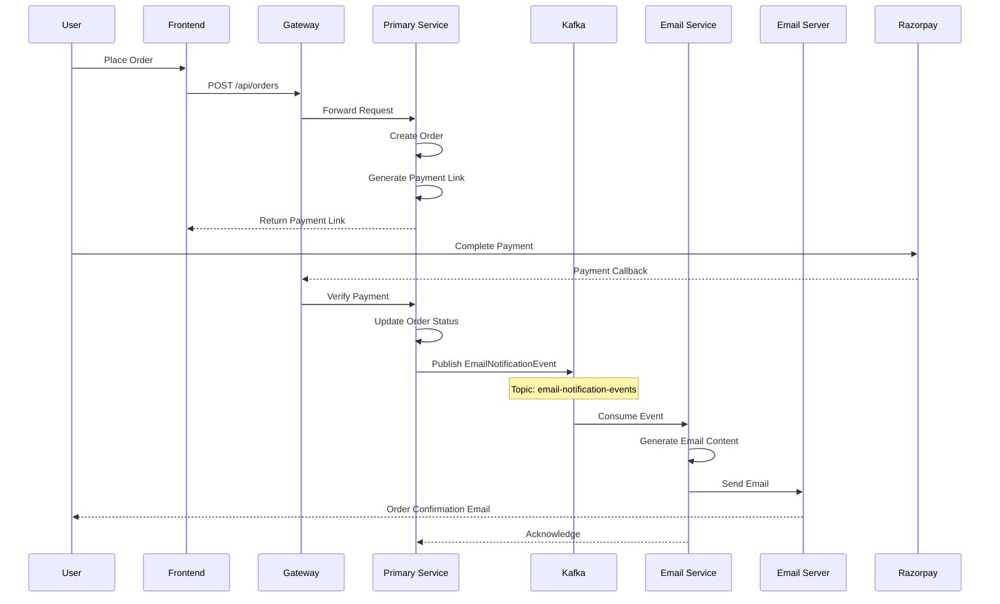
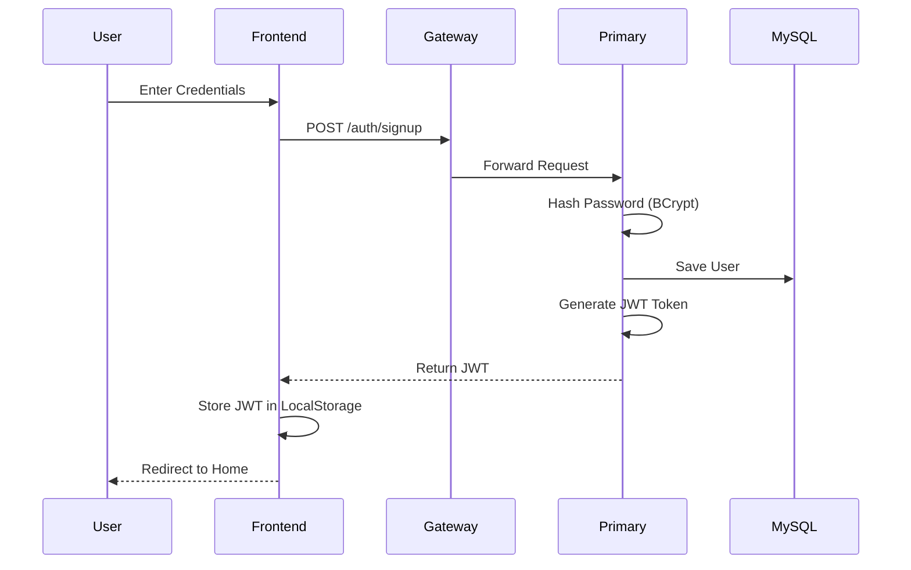
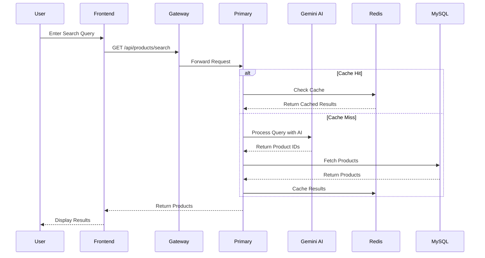
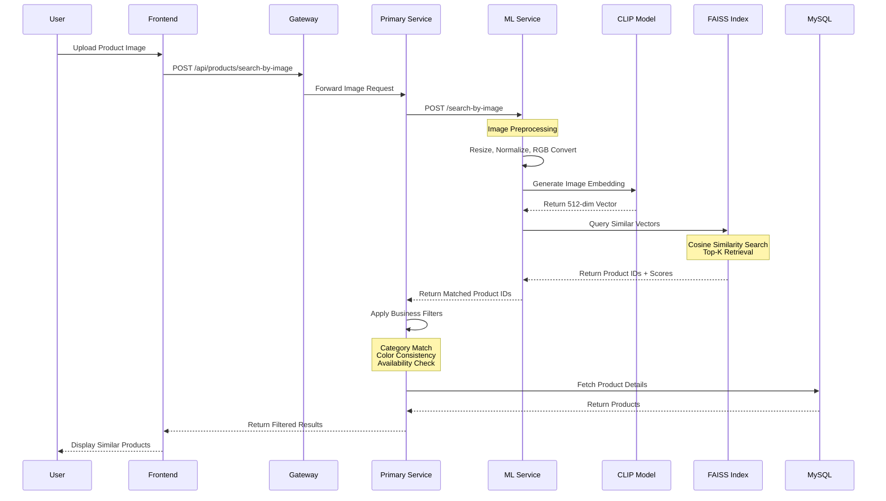
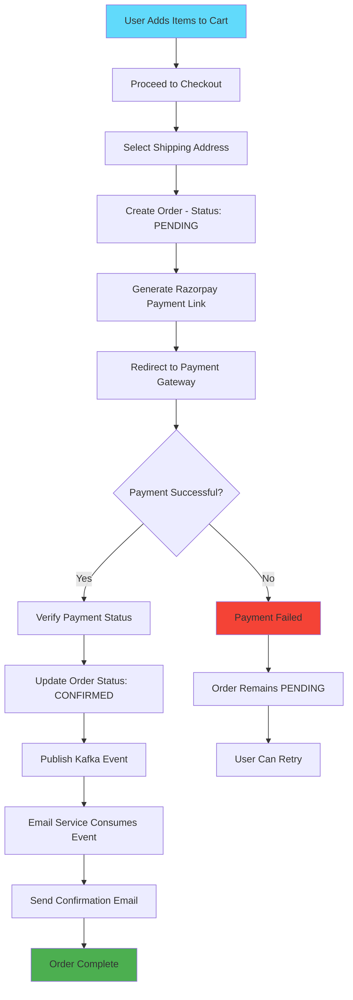
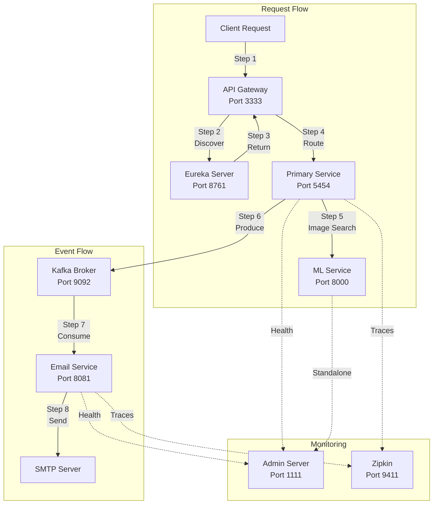
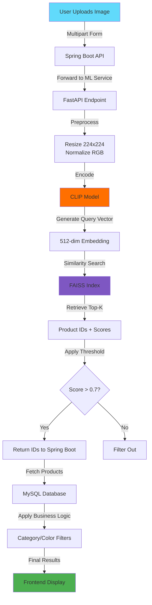

<div align="center">

# 🛍️ IntelliShopy - AI-Powered E-Commerce Platform

[](https://intellishopy.vercel.app)
[](https://spring.io/projects/spring-boot)
[](https://reactjs.org/)
[](https://microservices.io/)
[](https://openai.com/research/clip)

**A modern, scalable e-commerce platform with AI-powered text & image search, event-driven architecture, and microservices design**

</div>

---

## 📋 Table of Contents

- [Overview](#-overview)
- [Features](#-features)
- [Architecture](#-architecture)
- [Tech Stack](#-tech-stack)
- [Application Screenshots](#-application-screenshots)
- [System Workflow](#-system-workflow)
- [Microservices Details](#-microservices-details)
- [AI Features Deep Dive](#-ai-features-deep-dive)
- [Getting Started](#-getting-started)
- [Configuration](#-configuration)
- [API Documentation](#-api-documentation)
- [Testing](#-testing)
- [Security](#-security)
- [Performance Optimization](#-performance-optimization)
- [Docker Support](#-docker-support)
- [Monitoring--observability](#-monitoring--observability)
- [Roadmap](#-roadmap)
- [Contributing](#-contributing)
- [Author](#-author)
- [Acknowledgments](#-acknowledgments)

---

## 🌟 Overview

IntelliShopy is a production-ready, full-stack e-commerce platform built with modern technologies and best practices. It features a microservices architecture, **dual AI-powered search (text + image)**, secure payment integration, and asynchronous event processing for scalability and reliability.

### Key Highlights

✅ **AI-Powered Text Search** - Intelligent product discovery using Google Gemini API  
✅ **AI-Powered Image Search** - Visual similarity search using CLIP + FAISS  
✅ **Microservices Architecture** - Scalable, maintainable, and independently deployable services  
✅ **Event-Driven Design** - Kafka-based asynchronous communication for reliability  
✅ **Secure Authentication** - JWT-based stateless authentication  
✅ **Payment Integration** - Razorpay payment gateway integration  
✅ **High Performance** - Redis caching + Vector search for improved latency  
✅ **Service Discovery** - Eureka server for dynamic service registration  
✅ **API Gateway** - Centralized routing and load balancing  
✅ **Monitoring** - Spring Boot Admin & Actuator for health monitoring  
✅ **Distributed Tracing** - Zipkin integration for request tracing  
✅ **ML Microservice** - Dedicated FastAPI service for AI inference  

---

## ✨ Features

### User Features
- 🔐 **User Authentication & Authorization** - Secure JWT-based login/signup
- 🔍 **AI-Powered Text Search** - Smart search using natural language (Gemini API)
- 🖼️ **AI-Powered Image Search** - Find products by uploading similar images (CLIP + FAISS)
- 🛒 **Shopping Cart Management** - Add, update, remove items with real-time calculations
- 💳 **Secure Payment Processing** - Razorpay integration with payment confirmation
- 📦 **Order Management** - Track orders from placement to delivery
- ⭐ **Product Reviews & Ratings** - Post-delivery review system
- 📧 **Email Notifications** - Automated order confirmation emails

### Technical Features
- 🚀 **Redis Caching** - Product and category caching for reduced DB load
- 🤖 **ML Inference Service** - FastAPI microservice for image embeddings
- 🧠 **Vector Similarity Search** - FAISS-powered visual product matching
- 📨 **Event-Driven Architecture** - Kafka for asynchronous messaging
- 🔄 **Service Discovery** - Eureka for automatic service registration
- 🌐 **API Gateway** - Centralized routing with Spring Cloud Gateway
- 📊 **Monitoring & Observability** - Spring Boot Admin and Zipkin
- 🐳 **Docker Support** - Containerized deployment
- 🔒 **Layered Architecture** - Clean separation of concerns

---

## 🏗️ Architecture

### Microservices Architecture Diagram


```mermaid
graph TB
    subgraph "Client Layer"
        Client[React Frontend<br/>Port:  3000]
    end

    subgraph "Gateway Layer"
        Gateway[API Gateway<br/>Port: 3333]
    end

    subgraph "Service Registry"
        Eureka[Eureka Server<br/>Service Registry<br/>Port: 8761]
    end

    subgraph "Core Services"
        Primary[Primary Service<br/>E-Commerce Backend<br/>Port: 5454]
        
    end

    subgraph "Infrastructure"
        MySQL[(MySQL Database)]
        Redis[(Redis Cache<br/>Port: 6379)]
        Kafka[Kafka Broker<br/>Port: 9092]
        FAISS[(FAISS Index<br/>Vector Store)]
    end

    subgraph "External AI Services"
        Gemini[Google Gemini API<br/>Text Search]
        CLIP[OpenCLIP Model<br/>Image Embeddings]
    end

    subgraph "Monitoring"
        Admin[Admin Server<br/>Spring Boot Admin<br/>Port: 1111]
        Zipkin[Zipkin<br/>Distributed Tracing<br/>Port: 9411]
    end

    Client -->|HTTP Requests| Gateway
    Client -->|Image Upload| Gateway
    Gateway -->|Route Requests| Primary
    Gateway -->|Image Search| ML
    Gateway -.->|Service Discovery| Eureka
    
    Primary -.->|Register| Eureka
    Email -.->|Register| Eureka
    ML -.->|Standalone Service| Primary
    
    Primary -->|Read/Write| MySQL
    Primary -->|Cache| Redis
    Primary -->|Produce Events| Kafka
    Primary -->|Text Search API| Gemini
    Primary -->|Forward Images| ML
    
    ML -->|Load/Query| FAISS
    ML -->|Generate Embeddings| CLIP
    ML -->|Return Product IDs| Primary
    
    Kafka -->|Consume Events| Email
    Email -->|Send Emails| Client
    
    Primary -.->|Health Metrics| Admin
    Email -.->|Health Metrics| Admin
    Gateway -.->|Health Metrics| Admin
    
    Primary -.->|Trace Data| Zipkin
    Email -.->|Trace Data| Zipkin

    style Client fill:#61DAFB
    style Gateway fill:#68BC71
    style Eureka fill:#FFD700
    style Primary fill:#6DB33F
    style Email fill:#6DB33F
    style ML fill:#009688
    style Kafka fill:#231F20
    style MySQL fill:#4479A1
    style Redis fill:#DC382D
    style FAISS fill:#7E57C2
    style Gemini fill:#4285F4
    style CLIP fill:#FF6F00
    style Admin fill:#6DB33F
    style Zipkin fill:#FF6B6B
```

### Event-Driven Workflow


```mermaid
sequenceDiagram
    participant User
    participant Frontend
    participant Gateway
    participant Primary as Primary Service
    participant Kafka
    participant Email as Email Service
    participant SMTP as Email Server
    participant Payment as Razorpay

    User->>Frontend: Place Order
    Frontend->>Gateway:  POST /api/orders
    Gateway->>Primary: Forward Request
    Primary->>Primary: Create Order
    Primary->>Primary: Generate Payment Link
    Primary-->>Frontend: Return Payment Link
    
    User->>Payment: Complete Payment
    Payment-->>Gateway: Payment Callback
    Gateway->>Primary:  Verify Payment
    
    Primary->>Primary: Update Order Status
    Primary->>Kafka:  Publish EmailNotificationEvent
    
    Note over Kafka: Topic: email-notification-events
    
    Kafka->>Email:  Consume Event
    Email->>Email: Generate Email Content
    Email->>SMTP: Send Email
    SMTP-->>User: Order Confirmation Email
    
    Email-->>Primary: Acknowledge
```

---

## 🛠️ Tech Stack

### Frontend
| Technology | Purpose |
|------------|---------|
| **React** | UI Framework |
| **Redux** | State Management |
| **React Router** | Client-side Routing |
| **Material-UI** | Component Library |
| **Tailwind CSS** | Styling |
| **Axios** | HTTP Client |
| **Lucide Icons** | Icon Library |

### Backend - Primary Service
| Technology | Purpose |
|------------|---------|
| **Spring Boot** | Application Framework |
| **Spring Security** | Authentication & Authorization |
| **Spring Data JPA** | ORM & Database Access |
| **MySQL** | Relational Database |
| **Redis** | Caching Layer |
| **Kafka** | Message Broker |
| **JWT** | Token-based Authentication |
| **Razorpay SDK** | Payment Integration |
| **Gemini API** | AI Text Search |
| **RestTemplate** | ML Service Communication |

### Backend - Email Service
| Technology | Purpose |
|------------|---------|
| **Spring Boot** | Microservice Framework |
| **Kafka Consumer** | Event Processing |
| **JavaMailSender** | Email Delivery |
| **Thymeleaf** | Email Templates |

### Backend - ML Service (NEW)
| Technology | Purpose |
|------------|---------|
| **FastAPI** | Python Web Framework |
| **PyTorch** | Deep Learning Runtime |
| **OpenCLIP** | Image Embedding Model |
| **FAISS** | Vector Similarity Search |
| **Pillow (PIL)** | Image Processing |
| **NumPy** | Numerical Computing |
| **Uvicorn** | ASGI Server |

### Infrastructure & DevOps
| Technology | Purpose |
|------------|---------|
| **Docker** | Containerization |
| **Spring Cloud Gateway** | API Gateway |
| **Eureka Server** | Service Registry |
| **Spring Boot Admin** | Monitoring Dashboard |
| **Zipkin** | Distributed Tracing |
| **Maven** | Java Build Tool |
| **pip** | Python Package Manager |
| **Vercel** | Frontend Deployment |

---

## 📸 Application Screenshots

### Home Page
*Browse our curated collection of products with an intuitive interface*


---


### AI-Powered Text Search
*Experience intelligent product discovery with natural language search*


**Text Search Results**  


---

### 🆕 AI-Powered Image Search
*Revolutionary visual search - upload any product image to find similar items*


**Image Search Interface**  
*Drag and drop or click to upload product images for visual similarity search*


**Image Search Results**  
*CLIP AI finds visually similar products based on style, color, and patterns*


---

### User Authentication
*Secure signup and login with JWT authentication*


---

### Shopping Cart
*Manage your items with real-time price calculations*


---

### Checkout & Payment
*Seamless checkout experience with Razorpay integration*

---


### Order Management
*Track your orders from placement to delivery*


---

### Email Notifications
*Professional order confirmation emails with order details*


---


---

## 🔄 System Workflow

### 1. User Registration & Authentication Flow


```mermaid
sequenceDiagram
    participant User
    participant Frontend
    participant Gateway
    participant Primary
    participant MySQL
    
    User->>Frontend: Enter Credentials
    Frontend->>Gateway:  POST /auth/signup
    Gateway->>Primary: Forward Request
    Primary->>Primary: Hash Password (BCrypt)
    Primary->>MySQL: Save User
    Primary->>Primary: Generate JWT Token
    Primary-->>Frontend: Return JWT
    Frontend->>Frontend: Store JWT in LocalStorage
    Frontend-->>User: Redirect to Home
```

### 2. Product Search with AI (Text)


```mermaid
sequenceDiagram
    participant User
    participant Frontend
    participant Gateway
    participant Primary
    participant Gemini as Gemini AI
    participant Redis
    participant MySQL
    
    User->>Frontend: Enter Search Query
    Frontend->>Gateway: GET /api/products/search
    Gateway->>Primary: Forward Request
    
    alt Cache Hit
        Primary->>Redis:  Check Cache
        Redis-->>Primary:  Return Cached Results
    else Cache Miss
        Primary->>Gemini: Process Query with AI
        Gemini-->>Primary: Return Product IDs
        Primary->>MySQL:  Fetch Products
        MySQL-->>Primary: Return Products
        Primary->>Redis:  Cache Results
    end
    
    Primary-->>Frontend: Return Products
    Frontend-->>User: Display Results
```

### 3. 🆕 Product Search with AI (Image)


```mermaid
sequenceDiagram
    participant User
    participant Frontend
    participant Gateway
    participant Primary as Primary Service
    participant ML as ML Service
    participant CLIP as CLIP Model
    participant FAISS as FAISS Index
    participant MySQL
    
    User->>Frontend: Upload Product Image
    Frontend->>Gateway:  POST /api/products/search-by-image
    Gateway->>Primary: Forward Image Request
    Primary->>ML: POST /search-by-image
    
    Note over ML: Image Preprocessing
    ML->>ML:  Resize, Normalize, RGB Convert
    
    ML->>CLIP: Generate Image Embedding
    CLIP-->>ML: Return 512-dim Vector
    
    ML->>FAISS: Query Similar Vectors
    Note over FAISS: Cosine Similarity Search<br/>Top-K Retrieval
    FAISS-->>ML: Return Product IDs + Scores
    
    ML-->>Primary: Return Matched Product IDs
    
    Primary->>Primary: Apply Business Filters
    Note over Primary: Category Match<br/>Color Consistency<br/>Availability Check
    
    Primary->>MySQL: Fetch Product Details
    MySQL-->>Primary:  Return Products
    
    Primary-->>Frontend: Return Filtered Results
    Frontend-->>User: Display Similar Products
```

### 4. Order Placement & Payment


```mermaid
flowchart TD
    A[User Adds Items to Cart] --> B[Proceed to Checkout]
    B --> C[Select Shipping Address]
    C --> D[Create Order - Status:  PENDING]
    D --> E[Generate Razorpay Payment Link]
    E --> F[Redirect to Payment Gateway]
    F --> G{Payment Successful? }
    
    G -->|Yes| H[Verify Payment Status]
    H --> I[Update Order Status:  CONFIRMED]
    I --> J[Publish Kafka Event]
    J --> K[Email Service Consumes Event]
    K --> L[Send Confirmation Email]
    L --> M[Order Complete]
    
    G -->|No| N[Payment Failed]
    N --> O[Order Remains PENDING]
    O --> P[User Can Retry]
    
    style A fill:#61DAFB
    style M fill:#4CAF50
    style N fill:#F44336
```

### 5. Microservices Communication


```mermaid
graph TB
    subgraph RequestFlow["Request Flow"]
        A[Client Request]
        B[API Gateway<br/>Port 3333]
        C[Eureka Server<br/>Port 8761]
        D[Primary Service<br/>Port 5454]
        E[ML Service<br/>Port 8000]
        
        A -->|Step 1| B
        B -->|Step 2<br/>Discover| C
        C -->|Step 3<br/>Return| B
        B -->|Step 4<br/>Route| D
        D -->|Step 5<br/>Image Search| E
    end
    
    subgraph EventFlow["Event Flow"]
        F[Kafka Broker<br/>Port 9092]
        G[Email Service<br/>Port 8081]
        H[SMTP Server]
        
        D -->|Step 6<br/>Produce| F
        F -->|Step 7<br/>Consume| G
        G -->|Step 8<br/>Send| H
    end
    
    subgraph Monitor["Monitoring"]
        I[Admin Server<br/>Port 1111]
        J[Zipkin<br/>Port 9411]
    end
    
    D -.->|Health| I
    G -.->|Health| I
    D -.->|Traces| J
    G -.->|Traces| J
    E -.->|Standalone| I
```

---

## 🔍 Microservices Details

### 1. Service Registry (Eureka Server)

**Port:** 8761  
**Purpose:** Service discovery and registration

```properties
spring.application.name=Intellishopy-Service-Registory
server.port=8761
```

**Features:**
- Automatic service registration
- Dynamic service discovery
- Health monitoring
- Load balancing support

---

### 2. API Gateway

**Port:** 3333  
**Purpose:** Single entry point for all client requests

```properties
spring.application.name=Api-Gateway
server.port=3333
```

**Routes:**
- `/auth/**` → Primary Service (Authentication)
- `/api/**` → Primary Service (Protected APIs)
- `/products/**` → Primary Service (Product APIs)
- `/ml/**` → ML Service (Image Search - Optional)

**Features:**
- Request routing
- Load balancing
- Service discovery integration
- Centralized authentication

---

### 3. Primary Service (E-Commerce Backend)

**Port:** 5454  
**Purpose:** Core business logic and data management

**Key Components:**

#### Controllers
- `AuthController` - User authentication and registration
- `ProductController` - Product CRUD operations + Image search integration
- `OrderController` - Order management
- `CartController` - Shopping cart operations
- `PaymentController` - Razorpay integration
- `ReviewController` - Product reviews and ratings
- `AdminController` - Admin operations

#### Services
- `UserService` - User management and JWT handling
- `ProductService` - Product operations with Redis caching
- `ImageSearchService` - Integration with ML microservice (NEW)
- `OrderService` - Order processing
- `CartService` - Cart management
- `PaymentService` - Payment verification
- `KafkaProducerService` - Event publishing
- `EmailService` - Email sending

#### Models
- `User` - User entity with addresses and payment info
- `Product` - Product details with categories and sizes
- `Order` - Order with items and payment details
- `Cart` - Shopping cart with cart items
- `Address` - Shipping address
- `Review` & `Rating` - Product feedback

**Database Schema:**
```sql
-- Main tables
users
products
categories
orders
order_items
carts
cart_items
addresses
reviews
ratings
payment_information
```

**Redis Caching Strategy:**
- Cache products by category (TTL: 30 days)
- Cache individual products (TTL: 30 days)
- Cache-aside pattern implementation

**ML Service Integration:**
- RestTemplate-based HTTP communication
- Image multipart upload to ML service
- Product ID retrieval and filtering
- Fallback handling for service unavailability

---

### 4. Email Service

**Port:** 8081  
**Purpose:** Asynchronous email notifications

**Kafka Configuration:**
```properties
spring.application.name=Email-Service
kafka.topic. email-notification=email-notification-events
spring.kafka.consumer.group-id=ecommerce-consumer-group
```

**Features:**
- Consumes email events from Kafka
- HTML email templates using Thymeleaf
- Order confirmation emails
- Retry mechanism for failed emails
- Professional email formatting

**Email Templates:**
- `order-confirmation.html` - Order confirmation template
- `generic-email.html` - General notification template

---

### 5. 🆕 ML Service (AI Inference Engine)

**Port:** 8000  
**Framework:** FastAPI  
**Purpose:** Image embedding generation and visual similarity search

**Core Technology Stack:**
- **OpenCLIP** - Pre-trained vision-language model
- **FAISS** - Facebook AI Similarity Search for vector operations
- **PyTorch** - Deep learning inference runtime
- **Pillow** - Image preprocessing

**API Endpoints:**

#### Search by Image
```http
POST /search-by-image
Content-Type: multipart/form-data

{
  "file": <image_file>,
  "top_k": 10,
  "similarity_threshold": 0.7
}

Response: 200 OK
{
  "product_ids": [123, 456, 789],
  "scores": [0.92, 0.87, 0.81],
  "count": 3
}
```

#### Health Check
```http
GET /health

Response: 200 OK
{
  "status": "healthy",
  "model_loaded": true,
  "index_size": 15420
}
```

**Offline Indexing Process:**

The ML service requires a one-time indexing process before image search becomes available:

```bash
cd ML
python indexing.py
```

**What happens during indexing:**
1. Fetches all product image URLs from MySQL
2. Downloads and preprocesses each image
3. Generates 512-dimensional CLIP embeddings
4. Builds FAISS index for fast similarity search
5. Saves artifacts: 
   - `products.index` - FAISS vector database
   - `product_ids.npy` - Product ID mappings

**Performance Characteristics:**
- Embedding generation: ~50-100ms per image (CPU)
- Vector search: <10ms for top-K retrieval
- Index size: ~2KB per product
- Memory usage: ~100MB for 10K products

**Why Separate Microservice?**
- ML libraries are Python-first (PyTorch, FAISS, transformers)
- Independent scaling based on inference load
- No JVM overhead for deep learning operations
- Clear separation of concerns
- Can be deployed on GPU instances separately

---

### 6. Admin Server

**Port:** 1111  
**Purpose:** Centralized monitoring and management

**Features:**
- Service health monitoring
- Actuator endpoints aggregation
- Real-time metrics
- Application information

**Monitored Services:**
- Primary Service
- Email Service
- API Gateway
- ML Service (optional)

---

### 7. Zipkin (Distributed Tracing)

**Port:** 9411  
**Purpose:** Request tracing across microservices

**Features:**
- End-to-end request tracking
- Performance analysis
- Service dependency visualization
- Error tracking

---

## 🤖 AI Features Deep Dive

### 1. 🔍 Text-Based AI Search (Google Gemini)

**How It Works:**
- User enters natural language query (e.g., "blue formal shirt for wedding")
- Query is sent to Google Gemini API
- Gemini understands intent and extracts product attributes
- Returns relevant product IDs based on semantic understanding
- Results are fetched from MySQL and returned

**Advantages:**
- Understands context and synonyms
- Works with incomplete or vague queries
- Natural language processing
- No strict keyword matching required

---

### 2. 🖼️ Image-Based AI Search (CLIP + FAISS)

#### Problem Statement

Traditional keyword-based search fails when:
- Users don't know the exact product name
- Descriptions vary (e.g., "kurta" vs "ethnic wear")
- Visual attributes (pattern, fabric, drape) matter more than text

**Solution:** Search by visual similarity using deep learning

---

#### High-Level Architecture

```
Frontend (React)
   ↓ (image upload)
Spring Boot Backend
   ↓ (REST call)
Python ML Microservice (FastAPI)
   ↓
CLIP Model → Image Embedding
   ↓
FAISS Vector Search
   ↓
Matching Product IDs
   ↓
Spring Boot → MySQL
   ↓
Final Product Results to UI
```

---

#### Technology Breakdown

**CLIP (Contrastive Language-Image Pre-training)**
- Pre-trained on 400M+ image-text pairs
- Understands semantic visual concepts
- Generates 512-dimensional embeddings
- Zero-shot learning (no fine-tuning needed)
- Model:  `ViT-B-32` variant

**FAISS (Facebook AI Similarity Search)**
- Optimized for billion-scale vector search
- Cosine similarity with normalized vectors
- Sub-millisecond search latency
- Memory-efficient index structures
- Industry standard for production systems

---

#### Step-by-Step Workflow

**Phase 1: Offline Indexing (One-Time Setup)**


```mermaid
flowchart LR
    A[MySQL Database] -->|Fetch Product Images| B[Indexing Script]
    B -->|Download Images| C[Image Preprocessor]
    C -->|Resize + Normalize| D[CLIP Encoder]
    D -->|Generate Embeddings| E[512-dim Vectors]
    E -->|Build Index| F[FAISS Index File]
    F -->|Save Artifacts| G[products.index<br/>product_ids.npy]
    
    style G fill:#4CAF50
```

**Generated Files:**
- `products.index` - Binary FAISS index (~2KB per product)
- `product_ids.npy` - NumPy array mapping vectors to product IDs

**Why Offline? **
- Avoids real-time embedding generation
- Enables millisecond search latency
- One-time cost, infinite queries
- Scalable to millions of products

---

**Phase 2: Runtime Search (User Query)**


```mermaid
flowchart TD
    A[User Uploads Image] -->|Multipart Form| B[Spring Boot API]
    B -->|Forward to ML Service| C[FastAPI Endpoint]
    C -->|Preprocess| D[Resize 224x224<br/>Normalize RGB]
    D -->|Encode| E[CLIP Model]
    E -->|Generate Query Vector| F[512-dim Embedding]
    F -->|Similarity Search| G[FAISS Index]
    G -->|Retrieve Top-K| H[Product IDs + Scores]
    H -->|Apply Threshold| I{Score > 0.7?}
    I -->|Yes| J[Return IDs to Spring Boot]
    I -->|No| K[Filter Out]
    J -->|Fetch Products| L[MySQL Database]
    L -->|Apply Business Logic| M[Category/Color Filters]
    M -->|Final Results| N[Frontend Display]
    
    style A fill:#61DAFB
    style E fill:#FF6F00
    style G fill:#7E57C2
    style N fill:#4CAF50
```

---

#### Detailed Implementation

**1. Image Preprocessing**
```python
from PIL import Image
import torchvision.transforms as transforms

transform = transforms.Compose([
    transforms.Resize((224, 224)),        # CLIP input size
    transforms.ToTensor(),                # Convert to tensor
    transforms. Normalize(                  # ImageNet normalization
        mean=[0.485, 0.456, 0.406],
        std=[0.229, 0.224, 0.225]
    )
])
```

**Why these steps?**
- CLIP was trained on 224x224 images
- Normalization matches training distribution
- RGB conversion ensures color consistency
- Tensor format required for PyTorch

---

**2. Embedding Generation**
```python
import open_clip

model, preprocess = open_clip.create_model_and_transforms('ViT-B-32')
model.eval()

with torch.no_grad():
    embedding = model.encode_image(image_tensor)
    embedding = embedding / embedding.norm(dim=-1, keepdim=True)  # L2 normalization
```

**Why normalize?**
- Enables cosine similarity = dot product
- Scale-invariant comparisons
- Matches indexing process
- Improves FAISS performance

---

**3. FAISS Similarity Search**
```python
import faiss
import numpy as np

# Load pre-built index
index = faiss.read_index("products.index")
product_ids = np.load("product_ids.npy")

# Search for top-K similar vectors
k = 10
scores, indices = index.search(query_embedding, k)

# Filter by similarity threshold
threshold = 0.7
valid_results = [(product_ids[i], scores[0][idx]) 
                 for idx, i in enumerate(indices[0]) 
                 if scores[0][idx] > threshold]
```

**FAISS Parameters:**
- `IndexFlatIP` - Inner product (cosine for normalized vectors)
- `k` - Number of nearest neighbors to retrieve
- Similarity threshold - Filters weak matches (typically 0.6-0.8)

---

**4. Business Logic Filtering (Spring Boot)**

After receiving product IDs from ML service: 

```java
public List<Product> searchByImage(MultipartFile image) {
    // Call ML service
    List<Long> productIds = mlService.searchByImage(image);
    
    // Fetch from database
    List<Product> products = productRepository.findAllById(productIds);
    
    // Apply business filters
    return products.stream()
        .filter(p -> p.getQuantity() > 0)           // In stock
        .filter(p -> p.getCategory().isActive())    // Active category
        . filter(p -> ! p.isDiscontinued())            // Not discontinued
        .collect(Collectors.toList());
}
```

**Why hybrid approach?**
- ML handles visual similarity
- Database handles business rules
- Separation of concerns
- Flexible filtering without retraining

---

#### Accuracy & Limitations

**What CLIP Understands:**
- Clothing type (shirt, dress, jeans, kurta)
- Colors and patterns
- Fabric texture (visual approximation)
- Overall style and aesthetic

**What CLIP Struggles With:**
- Exact product matching
- Brand identification
- Fine-grained details (button style, stitching)
- Context-specific attributes (occasion, season)

**Mitigation Strategies:**
1. **Similarity Threshold** - Reject low-confidence matches
2. **Category Filtering** - Apply same-category constraint
3. **Top-K Limiting** - Show only best matches (typically K=10-20)
4. **Color Consistency** - Optional color-based post-filtering
5. **Hybrid Search** - Combine with text filters

**Expected Behavior:**
- Returns visually similar, not identical products
- May include different brands/styles with similar aesthetics
- Mirrors real-world e-commerce systems (Amazon, Pinterest)

---

#### Performance Benchmarks

| Operation | Latency | Notes |
|-----------|---------|-------|
| Image Upload | 50-200ms | Network + preprocessing |
| CLIP Encoding | 50-100ms | CPU inference (ViT-B-32) |
| FAISS Search | <10ms | 10K products, L2 normalized |
| MySQL Fetch | 20-50ms | Indexed product IDs |
| **Total E2E** | **150-400ms** | Acceptable for production |

**Scaling Considerations:**
- GPU inference:  Reduces encoding to 10-20ms
- FAISS GPU:  Supports billion-scale search
- Index sharding: Horizontal scaling for large catalogs
- CDN caching: Pre-compute popular image searches

---

#### Why This Design?

**Microservice Benefits:**
- Python ML ecosystem (PyTorch, FAISS, transformers)
- Independent scaling (CPU/GPU instances)
- Language-appropriate tools
- No JVM overhead for deep learning

**CLIP + FAISS Benefits:**
- No training data required (zero-shot)
- Works across product categories
- Fast inference and search
- Production-proven at scale

**Production Readiness:**
- Used by Pinterest, Shopify, Instacart
- Handles multi-modal search
- Supports incremental indexing
- Fault-tolerant (fallback to text search)

---

#### Future Enhancements

- [ ] **Multi-Image Search** - Upload multiple angles
- [ ] **Hybrid Text+Image** - Combine "blue kurta" + image
- [ ] **Attribute Extraction** - Auto-tag color, pattern, style
- [ ] **Fine-Tuning** - Train on e-commerce dataset
- [ ] **GPU Acceleration** - Faster inference
- [ ] **Real-Time Indexing** - Auto-update on new products
- [ ] **Visual Recommendations** - "Shop the look"

---

## 🚀 Getting Started

### Prerequisites

- **Java 17+**
- **Node.js 18+**
- **Python 3.8+** (for ML service)
- **MySQL 8.0+**
- **Redis**
- **Docker & Docker Compose** (optional)
- **Maven 3.6+**

---

### Environment Variables

Create `.env` files for each service:

#### Primary Service (.env)
```env
# Database
DB_HOST=localhost
DB_PORT=3306
DB_NAME=ecommerce
DB_USERNAME=root
DB_PASSWORD=your_mysql_password

# Razorpay
RAZERPAY_KEY=your_razorpay_key
RAZERPAY_SECRET_KEY=your_razorpay_secret

# Email
MAIL_PASSWORD=your_gmail_app_password

# Gemini AI
API_KEY=your_gemini_api_key

# Kafka
KAFKA_BOOTSTRAP_SERVERS=localhost:9092

# ML Service
ML_SERVICE_URL=http://localhost:8000
```

#### Email Service (.env)
```env
MAIL_PASSWORD=your_gmail_app_password
KAFKA_BOOTSTRAP_SERVERS=localhost:9092
```

#### ML Service (.env)
```env
# Model Configuration
CLIP_MODEL=ViT-B-32
CLIP_PRETRAINED=openai

# Search Parameters
DEFAULT_TOP_K=10
SIMILARITY_THRESHOLD=0.7

# Server
ML_SERVICE_PORT=8000
```

---

### Installation & Setup

#### Option 1: Docker Compose (Recommended)

1. **Clone the repository**
```bash
git clone https://github.com/atharvajagtap112/IntelliShopy.git
cd IntelliShopy
```

2. **Start infrastructure services**
```bash
cd Backend/Primary-Service
docker-compose up -d
```

This starts:
- MySQL
- Redis
- Kafka & Zookeeper
- Zipkin

3. **Setup ML Service**
```bash
cd ../../ML

# Create virtual environment
python -m venv venv
source venv/bin/activate  # On Windows: venv\Scripts\activate

# Install dependencies
pip install -r requirements.txt

# Run indexing (one-time setup)
python indexing.py

# Start ML service
uvicorn main:app --host 0.0.0.0 --port 8000
```

4. **Start microservices**
```bash
# Start Eureka Server
cd Backend/Service-Registory
mvn spring-boot:run

# Start Admin Server
cd ../Admin-Server
mvn spring-boot:run

# Start Primary Service
cd ../Primary-Service
mvn spring-boot:run

# Start Email Service
cd ../Email-Service
mvn spring-boot:run

# Start API Gateway
cd ../Api-Gateway
mvn spring-boot:run
```

5. **Start Frontend**
```bash
cd Frontend
npm install
npm start
```

---

#### Option 2: Manual Setup

**1. Setup MySQL**
```sql
CREATE DATABASE ecommerce;
```

**2. Setup Redis**
```bash
# Using Docker
docker run -d -p 6379:6379 redis:7-alpine

# Or install locally
# macOS: brew install redis && brew services start redis
# Ubuntu: sudo apt install redis-server && sudo systemctl start redis
```

**3. Setup Kafka**
```bash
# Using Docker
docker run -d --name kafka \
  -p 9092:9092 \
  -e KAFKA_ADVERTISED_LISTENERS=PLAINTEXT://localhost:9092 \
  apache/kafka:latest
```

**4. Setup Python Environment**
```bash
cd ML
python -m venv venv
source venv/bin/activate
pip install -r requirements.txt
```

**5. Run Initial Indexing**
```bash
# Make sure MySQL is running and has product data
python indexing.py
```

**6. Follow steps 4-5 from Docker Compose option**

---

### Access the Application

| Service | URL | Credentials |
|---------|-----|-------------|
| **Frontend** | http://localhost:3000 | - |
| **API Gateway** | http://localhost:3333 | - |
| **Primary Service** | http://localhost:5454 | - |
| **Email Service** | http://localhost:8081 | - |
| **ML Service** | http://localhost:8000 | - |
| **ML Service Docs** | http://localhost:8000/docs | - |
| **Eureka Dashboard** | http://localhost:8761 | - |
| **Admin Dashboard** | http://localhost:1111 | - |
| **Zipkin** | http://localhost:9411 | - |
| **Production** | https://intellishopy.vercel.app | - |

---

## ⚙️ Configuration

### Redis Configuration (Primary Service)

```properties
# Redis URL (Upstash Cloud)
spring.data.redis.url=rediss://your-redis-url

# Cache Configuration
spring.cache.type=redis
spring.cache.redis.time-to-live=2592000000  # 30 days

# Connection Pool
spring.data.redis.lettuce.pool.max-active=10
spring.data.redis.lettuce.pool.max-idle=5
```

### Kafka Configuration (Primary Service)

```properties
spring.kafka.bootstrap-servers=localhost:9092

# Producer
spring.kafka.producer.key-serializer=org.apache. kafka.common.serialization.StringSerializer
spring.kafka.producer. value-serializer=org.springframework.kafka.support.serializer. JsonSerializer
spring.kafka.producer.properties. spring.json.add.type.headers=true

# Topics
kafka.topic.email-notification=email-notification-events
```

### Kafka Configuration (Email Service)

```properties
# Consumer
spring.kafka.consumer.group-id=ecommerce-consumer-group
spring.kafka.consumer. auto-offset-reset=earliest
spring.kafka.consumer.key-deserializer=org.apache.kafka.common.serialization.StringDeserializer
spring.kafka. consumer.value-deserializer=org.springframework.kafka.support. serializer.ErrorHandlingDeserializer

# Type Mapping for Deserialization
spring.kafka.consumer.properties.spring.json.type.mapping=\
  com.atharva.ecommerce. DTO.EmailNotificationEvent:com.atharva.emailservice. DTO.EmailNotificationEvent
```

### ML Service Configuration (Python)

```python
# config.py
CLIP_MODEL = "ViT-B-32"
CLIP_PRETRAINED = "openai"
DEVICE = "cuda" if torch.cuda.is_available() else "cpu"
INDEX_PATH = "products.index"
IDS_PATH = "product_ids. npy"
TOP_K = 10
SIMILARITY_THRESHOLD = 0.7
```

### JWT Configuration

```java
// Secret Key
public static final String SECRET_KEY = "your-secret-key-here";
public static final String JWT_HEADER = "Authorization";
```

### Eureka Configuration

```properties
# All services register with Eureka
eureka.client.service-url.defaultZone=http://localhost:8761/eureka
eureka.instance.prefer-ip-address=true
```

---

## 📚 API Documentation

### Authentication APIs

#### Register User
```http
POST /auth/signup
Content-Type: application/json

{
  "firstName": "John",
  "lastName": "Doe",
  "email": "john@example.com",
  "password": "password123",
  "mobile": "1234567890"
}

Response: 200 OK
{
  "jwt": "eyJhbGciOiJIUzI1NiIsInR5cCI6IkpXVCJ9.. .",
  "message": "Signup success",
  "role": "CUSTOMER"
}
```

#### Login
```http
POST /auth/signin
Content-Type: application/json

{
  "email": "john@example.com",
  "password": "password123"
}

Response: 200 OK
{
  "jwt": "eyJhbGciOiJIUzI1NiIsInR5cCI6IkpXVCJ9.. .",
  "message": "Signin success",
  "role":  "CUSTOMER"
}
```

### Product APIs

#### Get All Products
```http
GET /api/products? category=mens_kurta&color=blue&minPrice=500&maxPrice=2000&minDiscount=40&sort=price_low&pageNumber=0&pageSize=10
Authorization: Bearer <jwt_token>

Response: 200 OK
{
  "content": [... ],
  "pageNumber": 0,
  "pageSize": 10,
  "totalElements": 45,
  "totalPages": 5
}
```

#### AI Text Search
```http
GET /api/products/search?query=blue formal shirt for men
Authorization: Bearer <jwt_token>

Response: 200 OK
[
  {
    "id":  1,
    "title": "Blue Formal Shirt",
    "price": 1499,
    "discountedPrice": 899,
    "imageUrl": "..."
  }
]
```

#### 🆕 AI Image Search
```http
POST /api/products/search-by-image
Authorization: Bearer <jwt_token>
Content-Type: multipart/form-data

{
  "image": <file>,
  "topK": 10,
  "category": "mens_kurta" (optional)
}

Response: 200 OK
[
  {
    "id":  123,
    "title": "Blue Ethnic Kurta",
    "price": 2499,
    "discountedPrice": 1499,
    "imageUrl": ".. .",
    "similarityScore": 0.92
  },
  {
    "id":  456,
    "title":  "Navy Blue Kurta Set",
    "price": 2999,
    "discountedPrice": 1799,
    "imageUrl": "...",
    "similarityScore": 0.87
  }
]
```

### ML Service APIs (Direct Access)

#### Search by Image
```http
POST http://localhost:8000/search-by-image
Content-Type: multipart/form-data

{
  "file": <image_file>,
  "top_k": 10,
  "similarity_threshold": 0.7
}

Response: 200 OK
{
  "product_ids": [123, 456, 789],
  "scores":  [0.92, 0.87, 0.81],
  "count": 3,
  "execution_time_ms": 85
}
```

#### Health Check
```http
GET http://localhost:8000/health

Response: 200 OK
{
  "status": "healthy",
  "model_loaded": true,
  "index_loaded": true,
  "index_size": 15420,
  "model":  "ViT-B-32",
  "device": "cpu"
}
```

### Cart APIs

#### Add to Cart
```http
PUT /api/cart/add
Authorization: Bearer <jwt_token>
Content-Type: application/json

{
  "productId": 1,
  "size": "M",
  "quantity": 2
}

Response: 201 CREATED
{
  "message": "item added to cart",
  "status": true
}
```

#### Get Cart
```http
GET /api/cart/
Authorization: Bearer <jwt_token>

Response: 200 OK
{
  "id": 1,
  "user": {... },
  "cartItems": [... ],
  "totalPrice": 2998,
  "totalItem": 2,
  "totalDiscountPrice": 1798
}
```

### Order APIs

#### Create Order
```http
POST /api/orders/
Authorization: Bearer <jwt_token>
Content-Type: application/json

{
  "streetAddress": "123 Main St",
  "city": "Mumbai",
  "state": "Maharashtra",
  "zipCode": "400001",
  "mobile": "1234567890"
}

Response: 201 CREATED
{
  "id": 1,
  "orderStatus": "PENDING",
  "totalPrice": 2998,
  "totalDiscountedPrice": 1798
}
```

#### Get User Orders
```http
POST /api/orders/user
Authorization: Bearer <jwt_token>
Content-Type: application/json

["ALL"]  // or ["PENDING", "CONFIRMED"]

Response: 201 CREATED
[
  {
    "id":  1,
    "orderDate": "2025-01-15T10:30:00",
    "orderStatus": "ORDER_CONFIRMED",
    "totalDiscountedPrice": 1798
  }
]
```

### Payment APIs

#### Create Payment Link
```http
POST /api/payments/123
Authorization: Bearer <jwt_token>

Response: 201 CREATED
{
  "payment_link_url": "https://rzp.io/l/abc123",
  "payment_link_Id": "plink_abc123"
}
```

#### Payment Callback
```http
GET /api/payments? payment_id=pay_123&order_id=1

Response: 200 OK
{
  "message": "your order get placed",
  "status": true
}
```

---

## 🧪 Testing

### Run Backend Tests
```bash
cd Backend/Primary-Service
mvn test
```

### Run Frontend Tests
```bash
cd Frontend
npm test
```

### Test ML Service
```bash
cd ML
pytest tests/
```

### Test Image Search Endpoint
```bash
curl -X POST "http://localhost:8000/search-by-image" \
  -H "Content-Type: multipart/form-data" \
  -F "file=@test_image.jpg" \
  -F "top_k=5"
```

---

## 🔒 Security

- **JWT Authentication**: Stateless token-based authentication
- **BCrypt Password Hashing**: Secure password storage
- **CORS Configuration**: Configured for frontend origin
- **Secure Headers**: Spring Security default headers
- **Input Validation**: Request validation at controller level
- **SQL Injection Prevention**: JPA parameterized queries
- **File Upload Validation**: Image type and size checks
- **ML Service Isolation**: No direct database access

---

## 🎯 Performance Optimization

1. **Redis Caching**
   - Products cached by category
   - 30-day TTL
   - Cache-aside pattern
   - Reduced DB load by ~70%

2. **FAISS Vector Search**
   - Sub-10ms similarity search
   - Optimized for high-dimensional vectors
   - Memory-efficient index structures
   - Scales to millions of products

3. **Connection Pooling**
   - Redis Lettuce pool (max 10 connections)
   - MySQL HikariCP (default configuration)

4. **Asynchronous Processing**
   - Kafka for email notifications
   - Non-blocking email delivery

5. **Query Optimization**
   - Eager/Lazy loading configuration
   - Indexed database columns
   - Pagination for large datasets

6. **ML Service Optimization**
   - Pre-computed embeddings (offline indexing)
   - Batch processing support
   - L2 normalization for faster similarity
   - Optional GPU acceleration

---

## 🐳 Docker Support

### Build Docker Images

```bash
# Primary Service
cd Backend/Primary-Service
docker build -t intellishopy-primary: latest .

# Email Service
cd ../Email-Service
docker build -t intellishopy-email:latest . 

# ML Service
cd ../../ML
docker build -t intellishopy-ml:latest . 
```

### Docker Compose

```yaml
version: '3.8'

services:
  mysql:
    image: mysql:8.0
    environment:
      MYSQL_DATABASE: ecommerce
      MYSQL_ROOT_PASSWORD: password
    ports:
      - "3306:3306"

  redis:
    image: redis:7-alpine
    ports: 
      - "6379:6379"

  kafka:
    image: apache/kafka:latest
    ports:
      - "9092:9092"

  zipkin:
    image: openzipkin/zipkin:latest
    ports:
      - "9411:9411"

  eureka:
    build: ./Backend/Service-Registory
    ports:
      - "8761:8761"

  ml-service:
    build: ./ML
    ports:
      - "8000:8000"
    volumes:
      - ./ML/products.index:/app/products.index
      - ./ML/product_ids.npy:/app/product_ids.npy

  primary-service:
    build: ./Backend/Primary-Service
    depends_on:
      - mysql
      - redis
      - kafka
      - eureka
      - ml-service
    environment: 
      - SPRING_PROFILES_ACTIVE=docker
      - ML_SERVICE_URL=http://ml-service:8000
    ports:
      - "5454:5454"

  email-service:
    build: ./Backend/Email-Service
    depends_on:
      - kafka
      - eureka
    ports:
      - "8081:8081"

  gateway:
    build: ./Backend/Api-Gateway
    depends_on:
      - eureka
    ports:
      - "3333:3333"

  admin: 
    build: ./Backend/Admin-Server
    ports:
      - "1111:1111"
```

---

## 📈 Monitoring & Observability

### Spring Boot Admin

Access:  http://localhost:1111

**Features:**
- Real-time health status
- JVM metrics
- HTTP traces
- Environment properties
- Logfile viewing

### Zipkin Tracing

Access: http://localhost:9411

**Features:**
- Request flow visualization
- Service dependencies
- Latency analysis
- Error tracking
- ML service integration tracking

### Actuator Endpoints

```bash
# Health check
curl http://localhost:5454/actuator/health

# Metrics
curl http://localhost:5454/actuator/metrics

# Info
curl http://localhost:5454/actuator/info
```

### ML Service Monitoring

```bash
# Health check
curl http://localhost:8000/health

# Metrics endpoint
curl http://localhost:8000/metrics
```

---

## 🚧 Roadmap

### Completed ✅
- [x] **AI Text Search** - Gemini API integration
- [x] **AI Image Search** - CLIP + FAISS implementation
- [x] **ML Microservice** - FastAPI inference engine


---

## 🤝 Contributing

Contributions are welcome! Please follow these steps:

1. Fork the repository
2. Create a feature branch (`git checkout -b feature/AmazingFeature`)
3. Commit your changes (`git commit -m 'Add some AmazingFeature'`)
4. Push to the branch (`git push origin feature/AmazingFeature`)
5. Open a Pull Request

---

## 👨‍💻 Author

**Atharva Jagtap**

- GitHub: [@atharvajagtap112](https://github.com/atharvajagtap112)
- Email: [atharvacjagtap2005@gmail.com](mailto:atharvacjagtap2005@gmail.com)
- LinkedIn: [Connect with me](https://linkedin.com/in/yourprofile)

---

## 🙏 Acknowledgments

- [Spring Boot](https://spring.io/projects/spring-boot) - Backend framework
- [React](https://reactjs.org/) - Frontend library
- [Apache Kafka](https://kafka.apache.org/) - Event streaming
- [Redis](https://redis.io/) - Caching solution
- [Razorpay](https://razorpay.com/) - Payment gateway
- [Google Gemini](https://deepmind.google/technologies/gemini/) - AI text search
- [OpenAI CLIP](https://openai.com/research/clip) - Vision-language model
- [FAISS](https://github.com/facebookresearch/faiss) - Vector similarity search
- [FastAPI](https://fastapi.tiangolo.com/) - Python web framework
- [PyTorch](https://pytorch.org/) - Deep learning framework

---

<div align="center">

### ⭐ Star this repository if you find it helpful! 

**Made with ❤️ by Atharva Jagtap**

[🌐 Live Demo](https://intellishopy.vercel.app) • [📧 Email](mailto:atharvacjagtap2005@gmail.com) • [💼 LinkedIn](https://linkedin.com/in/yourprofile)

</div>
